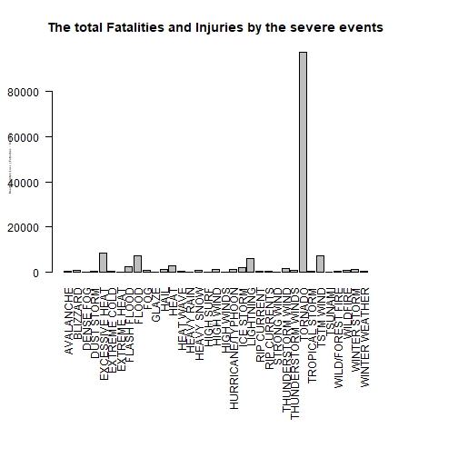

# Life and Economic Loss by Severe Weather events

## Synopsis


In this report we try to find the changes in population health loss and economic loss by the severe weather events in the United States between the years 1951 and 2011. Our overall hypothesis is that severe weather events  has made huge impact in people life and countries economy. To investigate this hypothesis, we obtained event data from the NOAA Storm Database which is collected from monitors sited across the U.S. We specifically obtained data for the years from 1951 and 2011. From these data, we found that, on average across the U.S., thousands of people lost  their life and injured and billion of dollars damaged all these years.   In particular two events are very dangerous to life and economy. Also these severe weather events makes disaster by an average of every year.


```r
library(dplyr)
library(ggplot2)
library(lubridate)
library(tidyr)
```

## Reading and Processing the Raw Data

Read the NOAA Storm Data as a compressed csv file and examine the data.


```r
storm_data <- read.csv("repdata_data_StormData.csv.bz2")
dim(storm_data)
```

```
## [1] 902297     37
```

```r
head(storm_data[, 1:15])
```

```
##   STATE__           BGN_DATE BGN_TIME TIME_ZONE COUNTY COUNTYNAME STATE
## 1       1  4/18/1950 0:00:00     0130       CST     97     MOBILE    AL
## 2       1  4/18/1950 0:00:00     0145       CST      3    BALDWIN    AL
## 3       1  2/20/1951 0:00:00     1600       CST     57    FAYETTE    AL
## 4       1   6/8/1951 0:00:00     0900       CST     89    MADISON    AL
## 5       1 11/15/1951 0:00:00     1500       CST     43    CULLMAN    AL
## 6       1 11/15/1951 0:00:00     2000       CST     77 LAUDERDALE    AL
##    EVTYPE BGN_RANGE BGN_AZI BGN_LOCATI END_DATE END_TIME COUNTY_END
## 1 TORNADO         0                                               0
## 2 TORNADO         0                                               0
## 3 TORNADO         0                                               0
## 4 TORNADO         0                                               0
## 5 TORNADO         0                                               0
## 6 TORNADO         0                                               0
##   COUNTYENDN
## 1         NA
## 2         NA
## 3         NA
## 4         NA
## 5         NA
## 6         NA
```

Then collect only the losses data and see the few data

```r
storm_data <- storm_data %>% 
          select (BGN_DATE,EVTYPE, FATALITIES, INJURIES, PROPDMG,PROPDMGEXP, CROPDMG, CROPDMGEXP  )

storm_data$BGN_DATE <- as.Date(storm_data$BGN_DATE, '%m/%d/%Y %H:%M:%S')
storm_data$year <- year(storm_data$BGN_DATE)


levels(storm_data$PROPDMGEXP)<- c("1", "1","1","1","1","1",
                                   "1","1","1","1","1","1","1", "1000000000",
                                   "100", "100", "1000", "1000000", "1000000")
levels(storm_data$CROPDMGEXP)<- c("1", "1", "1", "1", "100000000", "1000", "1000", "1000000", "1000000")

storm_data$PROPDMGEXP  <-as.numeric(levels(storm_data$PROPDMGEXP))[storm_data$PROPDMGEXP]
storm_data$CROPDMGEXP<-as.numeric(levels(storm_data$CROPDMGEXP))[storm_data$CROPDMGEXP]

storm_data$PROPDMG<- (storm_data$PROPDMG * storm_data$PROPDMGEXP)
storm_data$CROPDMG<-(storm_data$CROPDMG * storm_data$CROPDMGEXP)

storm_data$TOTALDMG<-(storm_data$CROPDMG + storm_data$PROPDMG)

head(storm_data)
```

```
##     BGN_DATE  EVTYPE FATALITIES INJURIES PROPDMG PROPDMGEXP CROPDMG
## 1 1950-04-18 TORNADO          0       15   25000       1000       0
## 2 1950-04-18 TORNADO          0        0    2500       1000       0
## 3 1951-02-20 TORNADO          0        2   25000       1000       0
## 4 1951-06-08 TORNADO          0        2    2500       1000       0
## 5 1951-11-15 TORNADO          0        2    2500       1000       0
## 6 1951-11-15 TORNADO          0        6    2500       1000       0
##   CROPDMGEXP year TOTALDMG
## 1          1 1950    25000
## 2          1 1950     2500
## 3          1 1951    25000
## 4          1 1951     2500
## 5          1 1951     2500
## 6          1 1951     2500
```

Lets aggragate the data by the event types

```r
aggrated_data <- storm_data  %>% 
                  select( FATALITIES, INJURIES, PROPDMG, CROPDMG,TOTALDMG, EVTYPE) %>% 
                              group_by(EVTYPE) %>% summarise_all(funs(sum))
```

Examine the data now

```r
head(aggrated_data)
```

```
## # A tibble: 6 x 6
##   EVTYPE                  FATALITIES INJURIES PROPDMG CROPDMG TOTALDMG
##   <fct>                        <dbl>    <dbl>   <dbl>   <dbl>    <dbl>
## 1 "   HIGH SURF ADVISORY"          0        0  200000       0   200000
## 2 " COASTAL FLOOD"                 0        0       0       0        0
## 3 " FLASH FLOOD"                   0        0   50000       0    50000
## 4 " LIGHTNING"                     0        0       0       0        0
## 5 " TSTM WIND"                     0        0 8100000       0  8100000
## 6 " TSTM WIND (G45)"               0        0    8000       0     8000
```

```r
summary(aggrated_data)
```

```
##                    EVTYPE      FATALITIES         INJURIES      
##     HIGH SURF ADVISORY:  1   Min.   :   0.00   Min.   :    0.0  
##   COASTAL FLOOD       :  1   1st Qu.:   0.00   1st Qu.:    0.0  
##   FLASH FLOOD         :  1   Median :   0.00   Median :    0.0  
##   LIGHTNING           :  1   Mean   :  15.38   Mean   :  142.7  
##   TSTM WIND           :  1   3rd Qu.:   0.00   3rd Qu.:    0.0  
##   TSTM WIND (G45)     :  1   Max.   :5633.00   Max.   :91346.0  
##  (Other)              :979                                      
##     PROPDMG             CROPDMG             TOTALDMG        
##  Min.   :0.000e+00   Min.   :0.000e+00   Min.   :0.000e+00  
##  1st Qu.:0.000e+00   1st Qu.:0.000e+00   1st Qu.:0.000e+00  
##  Median :0.000e+00   Median :0.000e+00   Median :0.000e+00  
##  Mean   :4.338e+08   Mean   :3.742e+07   Mean   :4.712e+08  
##  3rd Qu.:5.105e+04   3rd Qu.:0.000e+00   3rd Qu.:8.500e+04  
##  Max.   :1.447e+11   Max.   :1.262e+10   Max.   :1.503e+11  
## 
```

Also aggragate the data by the year

```r
yearly_aggragated_data <- storm_data  %>% 
          select( FATALITIES, INJURIES, PROPDMG, CROPDMG, year) %>% 
          group_by(year) %>% summarise_all(funs(sum))
```

Examine yearly aggragated the data

```r
head(yearly_aggragated_data)
```

```
## # A tibble: 6 x 5
##    year FATALITIES INJURIES   PROPDMG CROPDMG
##   <dbl>      <dbl>    <dbl>     <dbl>   <dbl>
## 1  1950         70      659  34481650       0
## 2  1951         34      524  65505990       0
## 3  1952        230     1915  94102240       0
## 4  1953        519     5131 596104700       0
## 5  1954         36      715  85805320       0
## 6  1955        129      926  82660630       0
```

## Results

### The total Fatalities and Injuries by the events those are greater than average threat


```r
aggrated_data$health <- aggrated_data$FATALITIES + aggrated_data$INJURIES  

par(mar=c(14, 4, 4, 6))
barplot(aggrated_data$health[aggrated_data$health > mean(aggrated_data$health)] , names.arg=aggrated_data$EVTYPE[aggrated_data$health > mean(aggrated_data$health)],
        main="The total Fatalities and Injuries by the severe events",
        xlab="Events", ylab="Health Related Loss ( Fatalities + Injuries)",
        las=2, cex.lab=0.25)
```



### Population Loss by the TORNADO alone by every year


```r
tornado_data <- storm_data  %>% group_by(year) %>% filter(EVTYPE == 'TORNADO') %>% gather(TYPE, LOSS, FATALITIES:INJURIES)

     ggplot(tornado_data, aes(x=year, y=LOSS, colour=TYPE))+
                geom_point()+
                facet_wrap(~TYPE)+
                labs(x = "Year", 
                     y = "Number of Losses", 
                     title="The total Fatalities and Injuries by TORNADO")
```


### The Property and Agriculture Demage by the events those are greater than average threat


```r
par(mar=c(14, 4, 4, 8))
barplot(aggrated_data$TOTALDMG[aggrated_data$TOTALDMG > mean(aggrated_data$TOTALDMG)] , names.arg=aggrated_data$EVTYPE[aggrated_data$TOTALDMG > mean(aggrated_data$TOTALDMG)],
        main="The total Property and Agriculture demage by Severe Events",
        xlab="Events", ylab="Economic Loss ( In thousands )",
        las=2, cex.lab=0.25)
```


### Which event caused most demage
#### 1. Fatalities

```r
     aggrated_data[which.max(aggrated_data$FATALITIES ),]
```

```
## # A tibble: 1 x 7
##   EVTYPE  FATALITIES INJURIES      PROPDMG   CROPDMG     TOTALDMG health
##   <fct>        <dbl>    <dbl>        <dbl>     <dbl>        <dbl>  <dbl>
## 1 TORNADO       5633    91346 56937160779. 414953270 57352114049.  96979
```
#### 2. Injuries

```r
     aggrated_data[which.max(aggrated_data$INJURIES ),]
```

```
## # A tibble: 1 x 7
##   EVTYPE  FATALITIES INJURIES      PROPDMG   CROPDMG     TOTALDMG health
##   <fct>        <dbl>    <dbl>        <dbl>     <dbl>        <dbl>  <dbl>
## 1 TORNADO       5633    91346 56937160779. 414953270 57352114049.  96979
```

#### 3. Property demage

```r
     aggrated_data[which.max(aggrated_data$PROPDMG ),]
```

```
## # A tibble: 1 x 7
##   EVTYPE FATALITIES INJURIES      PROPDMG    CROPDMG     TOTALDMG health
##   <fct>       <dbl>    <dbl>        <dbl>      <dbl>        <dbl>  <dbl>
## 1 FLOOD         470     6789 144657709807 5661968450 150319678257   7259
```

#### 4. Agriculture demage

```r
     aggrated_data[which.max(aggrated_data$CROPDMG ),]
```

```
## # A tibble: 1 x 7
##   EVTYPE  FATALITIES INJURIES    PROPDMG     CROPDMG    TOTALDMG health
##   <fct>        <dbl>    <dbl>      <dbl>       <dbl>       <dbl>  <dbl>
## 1 DROUGHT          0        4 1046106000 12622566000 13668672000      4
```

### The total losses by all these years
#### 1. Popluation Health ( Fatalities and Injuries )

```r
     sum(aggrated_data$health)
```

```
## [1] 155673
```
    
#### 2. Property demage ( in thousands)

```r
     sum(aggrated_data$PROPDMG)
```

```
## [1] 427318652972
```

#### 2. Agriculture demage ( in thousands )

```r
     sum(aggrated_data$CROPDMG)
```

```
## [1] 36855192181
```


### Yearly aggragation of all events

```r
     yearly_aggragated_data <- storm_data  %>% select( FATALITIES, INJURIES, PROPDMG, CROPDMG, year) %>% group_by(year) %>% summarise_all(funs(sum))
     head(yearly_aggragated_data)
```

```
## # A tibble: 6 x 5
##    year FATALITIES INJURIES   PROPDMG CROPDMG
##   <dbl>      <dbl>    <dbl>     <dbl>   <dbl>
## 1  1950         70      659  34481650       0
## 2  1951         34      524  65505990       0
## 3  1952        230     1915  94102240       0
## 4  1953        519     5131 596104700       0
## 5  1954         36      715  85805320       0
## 6  1955        129      926  82660630       0
```

```r
     summary( yearly_aggragated_data)
```

```
##       year        FATALITIES         INJURIES        PROPDMG         
##  Min.   :1950   Min.   :  24.00   Min.   :  524   Min.   :3.448e+07  
##  1st Qu.:1965   1st Qu.:  55.75   1st Qu.: 1044   1st Qu.:2.041e+08  
##  Median :1980   Median :  96.50   Median : 1790   Median :1.080e+09  
##  Mean   :1980   Mean   : 244.27   Mean   : 2267   Mean   :6.892e+09  
##  3rd Qu.:1996   3rd Qu.: 408.25   3rd Qu.: 2722   3rd Qu.:5.523e+09  
##  Max.   :2011   Max.   :1491.00   Max.   :11177   Max.   :1.219e+11  
##     CROPDMG         
##  Min.   :0.000e+00  
##  1st Qu.:0.000e+00  
##  Median :0.000e+00  
##  Mean   :5.944e+08  
##  3rd Qu.:1.133e+09  
##  Max.   :4.508e+09
```


It is clear that the severe weather events are making very significant damage to life and economy, in particular Tornado, Flood and Drought. Good prediction and precaution on such weather events can reduce the losses.
