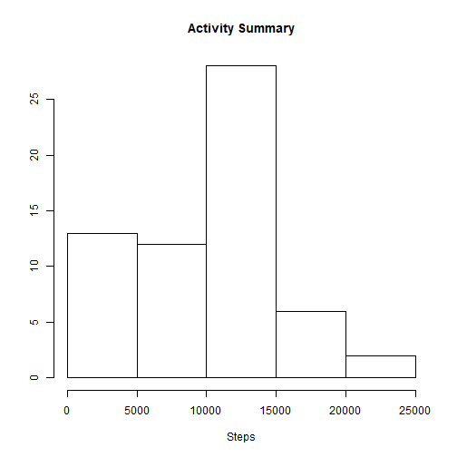
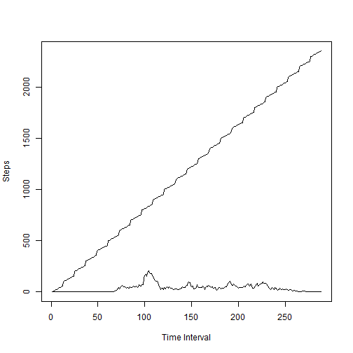
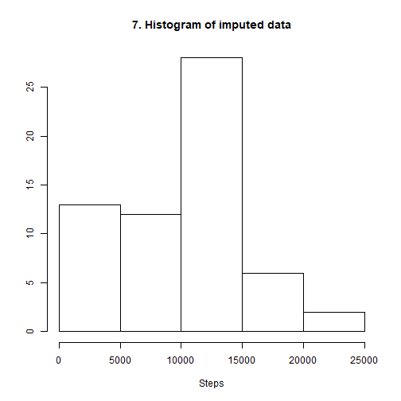

# Reproduce Research - project 1

Load required libraries


```r
library(dplyr)
library("ggplot2")
```

**1. Read data from the file**


```r
activity_data <- read.csv("activity.csv")
```

Calculate steps per day and

**2. Plot histogram**


```r
daily_activity <- with(activity_data, 
                       tapply(steps, date, sum, na.rm=TRUE))
daily_activity <- data.frame(date=names(daily_activity), steps=daily_activity)
hist(daily_activity$steps, main = "Activity Summary", xlab = "Steps", ylab = "")
```



**3. Mean and median steps of each day**


```
## 2012-10-01 2012-10-02 2012-10-03 2012-10-04 2012-10-05 2012-10-06 
##          0        126      11352      12116      13294      15420
```

```
## 2012-10-01 2012-10-02 2012-10-03 2012-10-04 2012-10-05 2012-10-06 
##          0        126      11352      12116      13294      15420
```

Calculate time interval's average steps

```r
time_activity <- with(activity_data, tapply(steps, interval, mean, na.rm=TRUE))
time_activity <- data.frame(interval=names(time_activity), steps=time_activity, stringsAsFactors = FALSE)
```

**4. Time series plot of the average number of steps taken**

```r
plot.ts(time_activity, plot.type=c("single"), ylab="Steps", xlab="Time Interval")
```



**5. The following interval has the maximum number steps taken by an average**

```
## [1] 167
```


### 6. Imputing missing values

The total number of missing data is

```
## [1] 2304
```


The missing values are reported as NA.
These missing / NA values are replaced by the daily avarage 
of on that day.

If ALL the activities were missing/NA then the daily average for 
that day is calculated as 0.


The following algorithem used to update the impute data.  


```r
impute_data <- read.csv("activity.csv")
daily_mean <- with(impute_data, 
                   tapply(steps, date, mean, na.rm=TRUE))
daily_mean <- data.frame(date=names(daily_mean), steps=daily_mean)

daily_mean$steps[is.nan(daily_mean$steps)] <- 0
for( i in 1:nrow(daily_mean)) {
      ind <- impute_data$date == daily_mean$date[i] & is.na(impute_data$steps)
      impute_data[ind, 1] <- daily_mean$steps[i]
}
```





Mean and median of imputed data


```
## 2012-10-01 2012-10-02 2012-10-03 2012-10-04 2012-10-05 2012-10-06 
##          0        126      11352      12116      13294      15420
```

```
## 2012-10-01 2012-10-02 2012-10-03 2012-10-04 2012-10-05 2012-10-06 
##          0        126      11352      12116      13294      15420
```

Based the comparision of the mean and meadian with same in section 3
there is no change.

The impact of adding the daily average to the missing data is nothing.
It could be the result, either if there is missing data on a day all the data is missing or there no data is missing on a day


**8. Differences in activity patterns between weekdays and weekends**         

```r
impute_data$date <- as.Date(impute_data$date)
impute_data$day <- ""
names(impute_data)[3] <- "Time"

weekdays <- c("Monday", "Tuesday", "Wednesday", "Thursday", "Friday")
weekenddays <- c("Saturday", "Sunday")

impute_data$day[weekdays(impute_data$date) %in% weekdays] <- "Weekday"
impute_data$day[weekdays(impute_data$date) %in% weekenddays] <- "Weekendday"

ggplot(impute_data, aes(x=Time, y=steps))+
      geom_line()+
      facet_wrap(~day)+
      labs(x = "Time", 
           y = "Steps", 
           title="Time series of imputed data")
```


